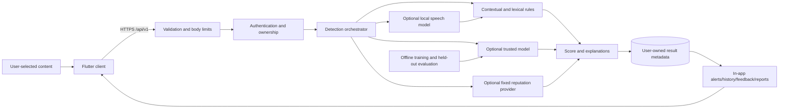

# Component diagram

```mermaid
flowchart LR
  U[User-selected content] --> F[Flutter client]
  F -->|HTTPS /api/v1| V[Validation and body limits]
  V --> A[Authentication and ownership]
  A --> D[Detection orchestrator]
  D --> R[Contextual and lexical rules]
  D --> M[Optional trusted model]
  D --> P[Optional fixed reputation provider]
  D --> W[Optional local speech model]
  R --> S[Score and explanations]
  M --> S
  P --> S
  W --> R
  S --> H[(User-owned result metadata)]
  H --> N[In-app alerts/history/feedback/reports]
  N --> F
  T[Offline training and held-out evaluation] --> M
```
